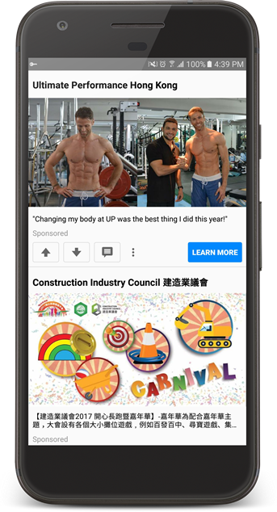
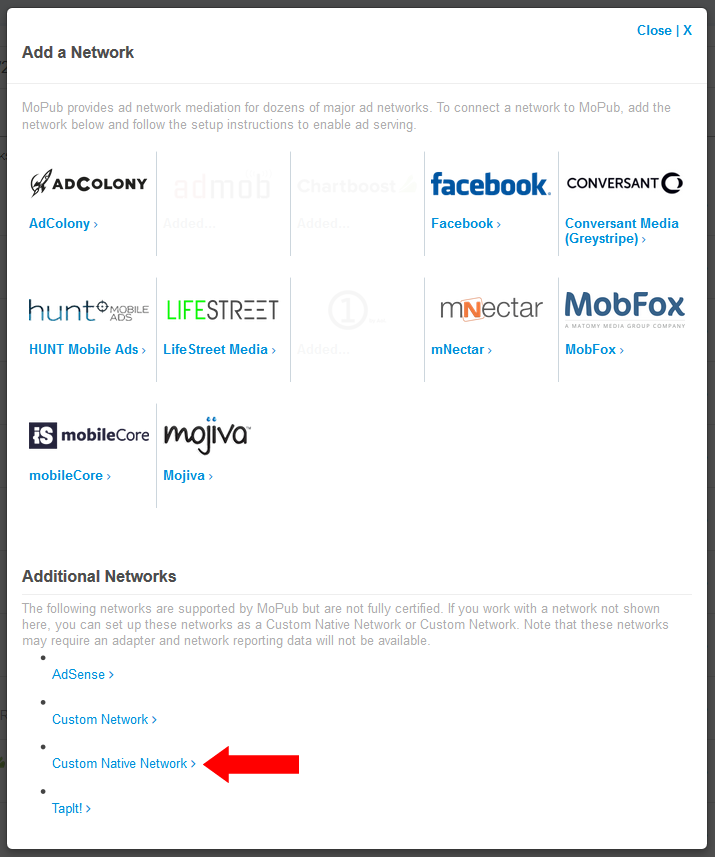
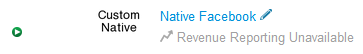
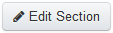
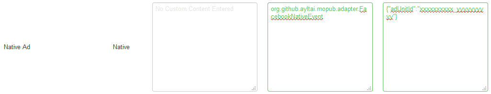

MoPub Native Ad Adapters
========================

[](https://jitpack.io/#ayltai/mopub-nativead-adapters) [](https://circleci.com/gh/ayltai/mopub-nativead-adapters) [](https://www.codacy.com/app/ayltai/mopub-nativead-adapters?utm_source=github.com&amp;utm_medium=referral&amp;utm_content=ayltai/mopub-nativead-adapters&amp;utm_campaign=Badge_Grade) [](https://www.codacy.com/app/ayltai/Newspaper?utm_source=github.com&amp;utm_medium=referral&amp;utm_content=ayltai/Newspaper&amp;utm_campaign=Badge_Coverage) [](https://www.versioneye.com/user/projects/589f25ef940b230031fbaf09) [](https://www.android.com/history/) [](https://github.com/ayltai/Newspaper/blob/master/LICENSE)

Custom adapters for [MoPub](http://www.mopub.com) native ads.



## Supported Adapters
* [AdMob Native Ads Advanced](https://firebase.google.com/docs/admob/android/native-advanced)
* [Facebook Audience Network](https://developers.facebook.com/docs/audience-network/android-native)
* [Flurry Native Ads](https://developer.yahoo.com/flurry/docs/publisher/code/android)
* [AppLovin Native Ads](https://www.applovin.com/developers)
* [MoPub](http://www.mopub.com) Built-in Native Ads

## Introduction
This is an Android library ready for most use cases. You can start getting working ads right away. If you want to understand what the implementation behind it, or you simply prefer to create custom adapters from scratch, please follow the instructions in these articles:
* [A complete guide to MoPub native ads mediation on Android (Part 1)](https://medium.com/@ayltai/a-complete-guide-to-mopub-native-ad-mediation-on-android-e6ecc2afff24)
* [A complete guide to MoPub native ads mediation on Android (Part 2)](https://medium.com/@ayltai/a-complete-guide-to-mopub-native-ads-mediation-on-android-part-2-1757c05e4815)
* [A complete guide to MoPub native ads mediation on Android (Part 3)](https://medium.com/@ayltai/a-complete-guide-to-mopub-native-ads-mediation-on-android-part-3-5a50bc935fbd)

## Gradle

### Step 1
Add [jitpack.io](https://jitpack.io) repository in your root project `build.gradle`:
```groovy
allprojects {
    repositories {
        ...
        maven { url 'https://jitpack.io' }
    }
}
```

### Step 2
Add the dependencies to your application project:
```groovy
dependencies {
    ...
    compile 'com.github.ayltai:mopub-nativead-adapters:1.0.1'
}
```

## AndroidManifest.xml

### Permissions
```xml
<manifest
    xmlns:android="http://schemas.android.com/apk/res/android"
    package="org.github.ayltai.mopub.adapter.app">
    ...
    <!-- Required -->
    <uses-permission android:name="android.permission.INTERNET" />

    <!-- Required by Facebook Audience Network and Flurry Ads -->
    <uses-permission android:name="android.permission.ACCESS_NETWORK_STATE" />

    <!-- Required by AppLovin -->
    <!-- Recommended for external memory pre-caching -->
    <uses-permission android:name="android.permission.WRITE_EXTERNAL_STORAGE" />

    <!-- Optional -->
    <!-- Recommended for location based ad targeting -->
    <uses-permission android:name="android.permission.ACCESS_COARSE_LOCATION" />
    <uses-permission android:name="android.permission.ACCESS_FINE_LOCATION" />
    ...
</manifest>
```

### Activities
```xml
<manifest
    xmlns:android="http://schemas.android.com/apk/res/android"
    package="org.github.ayltai.mopub.adapter.app">
    ...
    <!-- MoPub -->
    <activity
        android:name="com.mopub.mobileads.MoPubActivity"
        android:configChanges="keyboardHidden|orientation|screenSize" />
    <activity
        android:name="com.mopub.common.MoPubBrowser"
        android:configChanges="keyboardHidden|orientation|screenSize" />

    <!-- Facebook Audience Network -->
    <activity
        android:name="com.facebook.ads.AudienceNetworkActivity"
        android:configChanges="keyboardHidden|orientation|screenSize" />

    <!-- Flurry Ads -->
    <activity
        android:name="com.flurry.android.FlurryFullscreenTakeoverActivity"
        android:configChanges="keyboard|keyboardHidden|orientation|screenLayout|uiMode|screenSize|smallestScreenSize" />

    <!-- AppLovin -->
    <activity android:name="com.applovin.adview.AppLovinInterstitialActivity" />
    <activity android:name="com.applovin.adview.AppLovinConfirmationActivity" />
    ...
</manifest>
```

## ProGuard
You need to update your ProGuard rules in order to successfully make a release build of your application using this library. Please check [proguard-rules.pro](https://github.com/ayltai/mopub-nativead-adapters/blob/master/app/proguard-rules.pro) included in the [sample application](https://github.com/ayltai/mopub-nativead-adapters/tree/master/app).

## MoPub Administrator Console
You need to configure ad network mediation on [MoPub Administrator Console](https://app.mopub.com).

*Note: You need to disable all ad-blockers addons of your browser in order to perform the following steps successfully.*

### Preparations
First you need to setup your apps, ad units, orders, marketplace, etc. For details, please check the [official documentation](https://dev.twitter.com/mopub).

If you plan to mediate other ad networks, please check the followings accordingly:
* [AdMob Native Ads Advanced](https://support.google.com/admob)
* [Facebook Audience Network](https://developers.facebook.com/docs/audience-network/getting-started)
* [Flurry Native Ads](https://developer.yahoo.com/flurry/docs/howtos/nativeadintegration)
* [AppLovin Native Ads](https://www.applovin.com/getstarted)

### MoPub Ad Networks
The most important part of the setup is [Network](https://app.mopub.com/networks/v2).

#### Step 1: Create a Custom Native Network
Add a "Custom Native" network by clicking this button:


Select "Custom Native Network":



You can change the network title and update its advanced settings, but this is not necessary. Click "Save Section" to save the network and then go back to Network Detail page.

#### Step 2: Configure Custom Native Event classes
On the Network Detail page, click the pen icon next to the network title to edit it.



Under the corresponding apps, a list of supported ad units is shown. At the bottom, there is a button to let you enter the edit mode. **You need to click "Edit Section" button before doing any updates.** Otherwise, the changes will not be saved even though it seems they are.



Then you can enter the following information into the text boxes:



**Custom Event Class:** `org.github.ayltai.mopub.adapter.FacebookEventNative` (or any other `BaseEventNative` sub-classes supported by this library). If you have extended this classes, you must specify the exact package and class name accordingly.

**Custom Event Class Data:** `{"adUnitId":"xxxxxxxxxx_yyyyyyyyyy"}`. Replace it with your Facebook placement ID of your ad (or any other ad unit id you need for your ad network). Note that for some ad network, you may also need to specify `apiKey` in this field. The format is in JSON.

### Coding

#### Step 4: Design your native ad view layout
Create your native ad view layout just like any other view layouts. You may use any UI components you need. Please check the [sample layout](https://github.com/ayltai/mopub-nativead-adapters/blob/master/app/src/main/res/layout/view_native_ad.xml).

#### Step 5: Initialize MoPub
You need to initialize MoPub native ads SDK like this:
```java
moPubNative = new MoPubNative(context, adUnitId, moPubNativeNetworkListener);
moPubNative.registerAdRenderer(new MoPubStaticNativeAdRenderer(new ViewBinder.Builder(R.layout.view_native_ad)
    .titleId(R.id.ad_title)
    .textId(R.id.ad_body)
    .mainImageId(R.id.ad_image)
    .callToActionId(R.id.ad_call_to_action)
    .build()));
```
Here we specify the view layout resource, `view_native_ad`, for the `ViewBinder`, and tell it to use the view IDs for various fields.

`adUnitId` is the MoPub ad unit ID that you have set up for your application.

`moPubNativeNetworkListener` contains callbacks that you will use later.

#### Step 6: Request native ads
```java
moPubNative.makeRequest(new RequestParameters.Builder()
    .desiredAssets(EnumSet.of(
        RequestParameters.NativeAdAsset.TITLE,
        RequestParameters.NativeAdAsset.TEXT,
        RequestParameters.NativeAdAsset.MAIN_IMAGE,
        RequestParameters.NativeAdAsset.CALL_TO_ACTION_TEXT))
    .build());
```
Here we request a native ad with title text, body text, main image and call-to-action text. You can also request other fields if you want.

You will receive the result of the request in `MoPubNativeNetworkListener` callbacks.

#### Step 7: Native ad request callbacks
```java
@Override
public void onNativeLoad(NativeAd nativeAd) {
    nativeAd.setMoPubNativeEventListener(moPubNativeEventListener);
    nativeAd.renderAdView(view);
    nativeAd.prepare();
}

@Override
public void onNativeFail(NativeErrorCode errorCode) {
    // Handle failures here
    //
    // There can be many reasons of failure:
    // - No ads available
    // - Network failure
    // - Configuration error
    // - ... etc
}
```
If a native ad is returned successfully in `onNativeLoad()`, you can attach a `MoPubNativeEventListener` to it to receive further callbacks, such as `onImpression(View)` and `onClick(View)`. It is not necessary to listen to these callbacks though.

Calling `renderAdView(view)` will automatically set the title text, body text, main image, etc. to the given `view`. The `view` must be inflated with the same layout you specified to the `ViewBinder` earlier above.

Calling `prepare(view)` will attach various ad tracking callbacks for you automatically, so that ad impressions and clicks can be tracked correctly.

*Note: If you are going to re-use the view for another `NativeAd` instance, you need to call `NativeAd.clear(View)` before doing so.*

#### Step 8: Clean up
```java
nativeAd.destroy();
moPubNative.destroy();
```

When you are done with the ad (e.g. closing an Activity, or even closing the application), you need to destroy all the `NativeAd` instances you have received in `onNativeLoad(NativeAd)`, otherwise memory leaks may occur. For the same reason, you need to destroy the `MoPubNative` instance.

## Common Problems and Solutions

**The main image is very small and does not fit all the available width.**

You may try to resize your `ImageView` after calling `renderAdView` and `prepare` methods. Like this:
```java
DisplayMetrics metrics = new DisplayMetrics();
((WindowManager)adContainerView.getContext().getSystemService(Context.WINDOW_SERVICE)).getDefaultDisplay().getMetrics(metrics);

ViewGroup.LayoutParams params = imageView.getLayoutParams();
params.width  = metrics.widthPixels;
params.height = (int)(metrics.widthPixels / 1.91f + 0.5f);

imageView.setLayoutParams(params);
```

The aspect ratio, 1.91, is the industry standard. But some ad providers may not comply.

**How to design an universal view to display native ads from all ad providers?**

This is not an easy task. AdMob, for instance, requires you to wrap your layout inside either `NativeAppInstallAdView` or `NativeContentAdView`, depending on which kind of ad they send to you. This is very troublesome and forces you to design view layouts specifically for AdMob only.

Here we provide a [working example](https://github.com/ayltai/mopub-nativead-adapters/blob/master/app/src/main/java/org/github/ayltai/mopub/adapter/app/NativeAdAdapter.java) of how to workaround this by inflating ad view layouts dynamically.

**In slow network condition, it is slow to fetch ads. Can I pre-fetch ads, or re-use previously displayed ads?**

Yes! It is a bit tricky but not hard at all. I would like to leave it to the reader as an exercise.

**How to customize ad requests and apply ad targeting?**

You can do it by extending [BaseEventNative](https://github.com/ayltai/mopub-nativead-adapters/blob/master/adapters/src/main/java/org/github/ayltai/mopub/adapter/BaseEventNative.java) and override `onLoadNativeAd(BaseStaticNativeAd)` method and put any ad targeting data to `BaseStaticNativeAd`.

## Sample Application
A working example can be found [here](https://github.com/ayltai/mopub-nativead-adapters/tree/master/app)

## Requirements
This library supports Android 4.1 Jelly Bean (API 16) or later.
